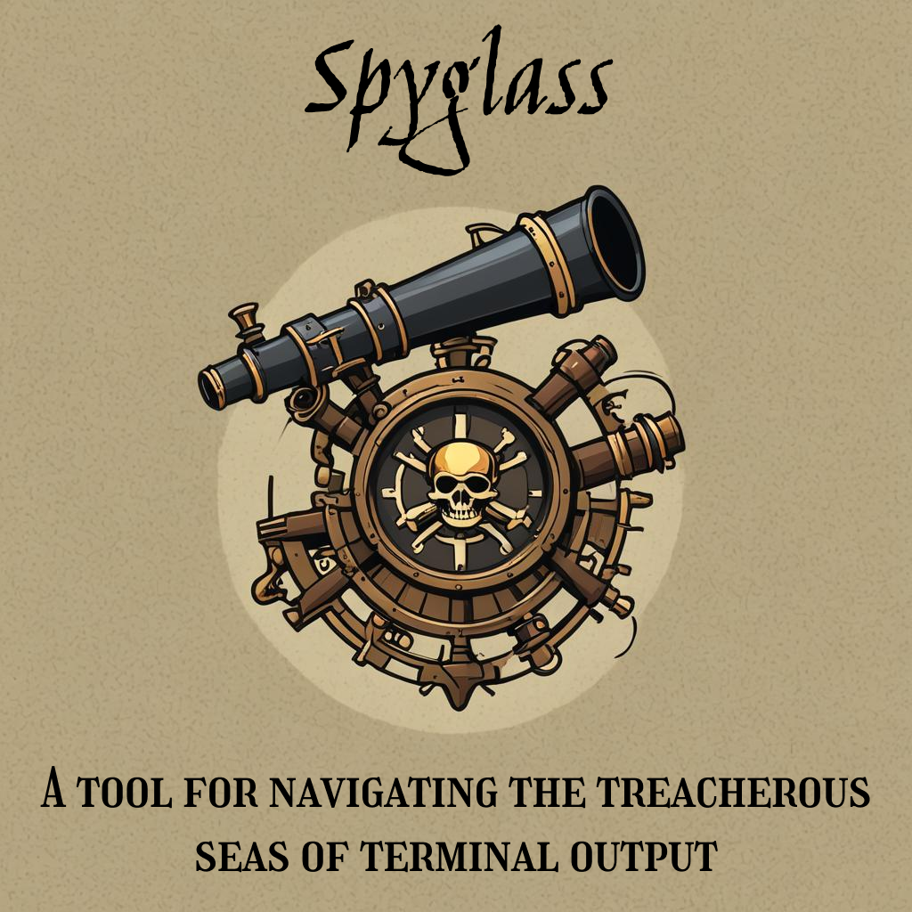
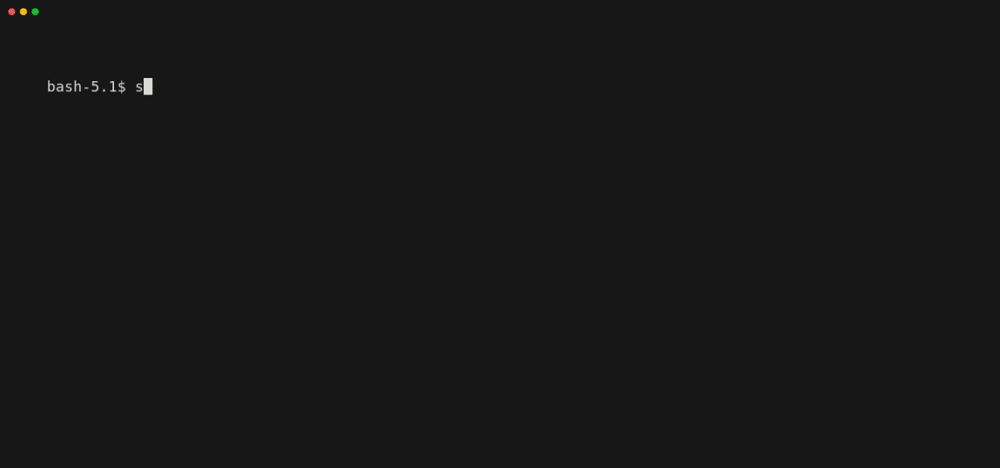

# Spyglass

A tool for navigating the treacherous seas of terminal output.



## Demo


## Installation

> [!NOTE]  
> Releases will be avaliable in the near future.

The easiest way to install is to create a symbolic link that is available within your in your `$PATH`. I recommend `/usr/local/bin`.

This allows you to simply `git pull` this repo whenever you want the latest version from the `main` branch.

```bash
git clone git@github.com:CodeZea1ot/spyglass.git
cd spyglass
sudo ln -s $(pwd)/spyglass.sh /usr/local/bin/spyglass
```

Alternatively, if you don't want to use `git pull` to update, you can just copy the binary script into your `$PATH`. Again, `/usr/local/bin` is probably the best choice.

```bash
git clone git@github.com:CodeZea1ot/spyglass.git
cd spyglass
sudo cp $(pwd)/spyglass.sh /usr/local/bin/spyglass
```

## Uninstall
To uninstall, simply `rm` the symbolic link or copied binary you created during installation. If you put it in `/usr/local/bin` you could just do the following.

```bash
sudo rm /usr/local/bin/spyglass
```

## Options
- [`-c`](#smart-color-formatting): Enable smart color formatting (default is disabled)
- [`-d`](#line-delay): Set the delay in seconds between each line output (default is 0.1)
- [`-D`](#group-delay): Set the delay in seconds between each group of -n lines output (default is 0)
- [`-k`](#keep-last-group): Keep the last group of output drawn to the terminal (default is to clear)
- [`-K`](#keep-all-groups): Keep all output drawn to the terminal (default is to clear)
- [`-n`](#group-size): Specify the maximum number of lines to display as a group (default is 8)
- [`-s`](#line-spacing): Set the amount of line breaks that should appear after each line (default is 0)

## Configuration

### Smart Color Formatting

The `-c` flag enables smart color formatting for each line being drawn to the terminal. If a keyword is detected anywhere in the line, the corresponding color will be applied.

If multiple keywords exist in the line being formatted, the match with the highest priority value will be applied.

If no keywords are found, a color will not be applied to the line.

| Keyword        | Color    | Description               | Priority    |
|----------------|----------|---------------------------|-------------|
| error          | Red      | Error message             |      3      |
| warn           | Yellow   | Warning message           |      2      |
| success        | Green    | Success message           |      1      |
| successfully   | Green    | Success message           |      1      |
| finished       | Green    | Completion message        |      1      |
| complete       | Green    | Completion message        |      1      |
| completed      | Green    | Completion message        |      1      |
| done           | Green    | Completion message        |      1      |
| info           | Blue     | Informational message     |      0      |
| downloading    | Blue     | Download status message   |      0      |


<details>
<summary>Show Example</summary>
<br>


</details>

### Line Delay

The `-d` flag lets you set the amount of time that passes between each line being drawn to the terminal. It expects to be followed by a numerical value like `1`, `0.2`, etc.

<details>
<summary>Show Example</summary>
<br>


</details>


### Group Delay

The `-D` flag lets you set the amount of time that passes before the most recent line group is cleared from the terminal. It expects to be followed by a numerical value like `1`, `0.2`, etc.

<details>
<summary>Show Example</summary>
<br>


</details>

### Keep Last Group

The `-k` flag tells spyglass to persist the last group of output drawn to the terminal.

<details>
<summary>Show Example</summary>
<br>


</details>

### Keep All Groups

The `-K` flag tells spyglass to persist all output drawn to the terminal.

<details>
<summary>Show Example</summary>
<br>


</details>

### Group Size

The `-n` flag lets you set the maximum number of lines to display as a group in the terminal. It expects to be followed by a whole number like `5`, `10`, `20`, etc.

<details>
<summary>Show Example</summary>
<br>


</details>

### Line Spacing

The `-s` flag lets you set the amount of line breaks you'd like to appear after each line is drawn in the terminal. It expects to be followed by a whole number like `5`, `10`, `20`, etc.

<details>
<summary>Show Example</summary>
<br>


</details>